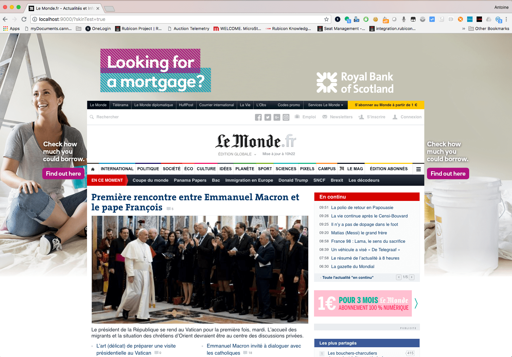
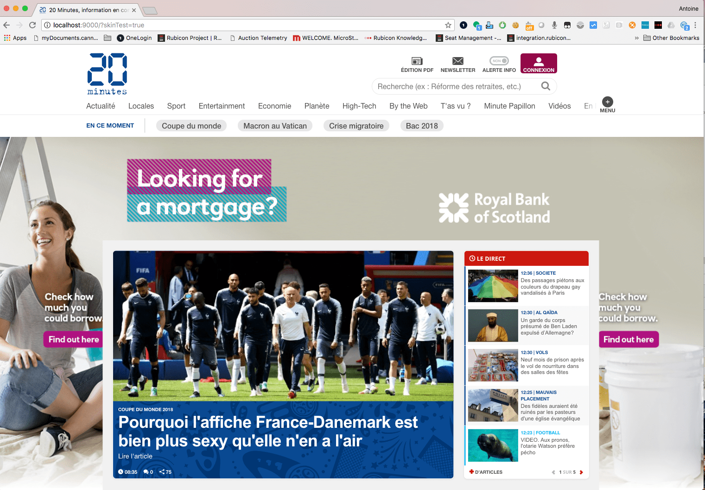

# Prebid Skin Implementation Guide

## A - Build files

1- run `npm install`

2- run `npm run build`  -> it will create the bundle file in the dist folder

3- (optional) `npm run dev` -> it will create a dev server and a test page on http://localhost:9000/
The test page will be the page located in the "test" folder and with "Index" as a string in the name.
Please use the test response in the ressources folder and Charles mapping to test it.

#### Demo docs (with piccies)

https://docs.google.com/document/d/1FoJA8VgsEE7fJ_QPI_REUyl4QU2sN3FDVXqXm1JNgLI/edit#heading=h.ijojjndzbkfx

#### LeMonde (body wrapping)

This integration is an example of using the resize mode with LeMonde website.

#### 20Minutes (content wrapping)

This integration is an example of using the ratio with maxRatio (0.9) mode with 20Minutes website.

## B- Examples

	

***  

`@trystring` : is essentially a string (bit of text) used as a query selector.
You must use operators such as `# . <>` then the skins code will try and use convential DOM look up methods.

So, to select an `<element>` with an ID of "foo", you'd use (`#foo`).

So, to select an `<element>` with an Class of "foo", you'd use (`.foo`).
or with a class of foo `.foo`:

If several elements are using the same ID or Class, the first one will be selected. 

*** 

### Here is the list of the parameters and their options:

| DataParam               | Type               | Default | Notes |
| ------------------------| -------------------|---------|-------|
|`fullBids`                 |`@object`   |`bids`  | required. The bid containing the creative to display. No change or edit allowed!
|`insertionMarker`          |`@trystring`|`null`  | required. The dom element where the div that insert skin and pushes site content down is created.
|`contentWidthMarker`       |`@trystring`|`null`  | required. Used by the renderer as a basis for the width of the website content area. Content area is the exciting part of the website.
|`insertionType`            |`@string`,  |`null`  | required. A string that represents how the skin will be integrate, possible value are ratio, resize.
|`maxRatio`                 |`@int`      |`1`     | optional, maximum ratio scale, will activate also the smart ratio feature.
|`header_height`            |`@int`      |`250`   | optional, override the standard config creative width (250px) or special site architecture
|`creativeWidth`            |`@int`      |`1800`  | optional, override the standard config creative width (1800px).
|`custom_style_iframe`      |`@string`   |`null`  | optional, pass in valid CSS, and it will be appended to the iframe document as style property.
|`custom_style_page`        |`@string`   |`null`  | optional, pass in valid CSS, and it will be appended inside a `<style>` elem in the `<head>` of the main page document.
|`targetScroll`             |`@bool`     |`false` | optional, if the creative need to be scrolled.
|`iframe_url`               |`@string`   |`null`  | optional, use custom url for the iframe. Useful for protecting the main page if the iframe domain is different from delivery page one, as cross domain will block any changes attempts on the main page from the iframe or creative.
|`click_url`                |`@string`   |`null`  | optional, allow to track click on the skin creative.
|`debug`                    |`@bool`     |`false` | optional, allow to show a test creative. Must be removed in production.

### Iframe

If you decide to use the "iframe_url", please use the following code. 
Hosting the iframe on a domain different from the page could be useful on the open auctionif you want to protect your website and make sure the creative won't be able to make any edit on the main page.

    <html>
        <head>
            
        </head>
        <body></body>
    </html> 

## C- Integration

#### 1- Add the adUnit to the page:

Add the new adUnit with the renderer part and target it on a DFP slot, do notice that this adSlot could be a size different from the skin adUnit size and will be resize to 1x1 if the prebid creative is selected. 

#### 2- Adapt the skin render parameters:

Use the fields description tab above to use and edit the correct fields. There are 4 require parameters:

`insertionMarker`: You can use "body" directly if you want to wrap the whole page or the dom element where the div that inserts skin and pushes site content down is created. For instance if you want to keep the menu on the top.

`contentWidthMarker`: Used by the renderer as a basis for the width of the website content area. Content area is the exciting part of the website and not necessarily the wrap, you could use and test different value. 

`insertionType`: A string that represents how the skin will be integrate, possible value are:
    -ratio: will rescale the page to make sure the whole creative is shown and the page structure will stay the same. If the page appear too small you can use the maxRatio
    -ratio (+ maxRatio field): will change the creative size or page scale to create the best render without rescalling over the maxRatio limit.
    -resize: will resize the page to show the creative bands area without rescalling. Depending on the screen size, creative could appear to large and some sites may need additional CSS edits using the "custom_style_page" fields. 

`fullBids`: don't edit, it is the bids object.

I would recommend trying the different method and select the best one for your site. Please use a conditionnal adUnit if you want to exclude certain screen size or devices.  

#### 3- DFP setup:

Create the DFP prebid line items for the Skin adUnits and sizes following the prebid documentation. 

## D- Testing

Prebid doesn't provide any way to force a dummy bids but there is a workaround to trigger the prebid Skin.
First you need to use a standard size for the prebid Skin adUnits such as `sizes: [[300,250]]` with Rubicon Prebid Test Ids:
    `accountId: "14062",
     siteId: "70608",
     zoneId: "335918"`

#### 1 - Prepare DFP:

Create a sponsorship line item in DFP targeting the skin adUnit and the keyword `hb_adid_rubicon=testSkin`.

Followed prebid documentation to add a new standard Prebid creative in DFP for the skin adUnit size and rubicon bidder (`w.pbjs.renderAd(document, '%%PATTERN:hb_adid_rubicon%%');`).

#### 2- Create a test page:

Use a dummy test page of your site or directly your QA environment. Add the new adUnit with Rubicon test Ids and target it on a DFP slot, do notice that this adSlot could be a size different from the skin adUnit size and will be resize to 1x1 if the prebid creative is selected. 

#### 3- Adapt the skin render parameters:

See integration part. Make sure your test page is the same than the production website. 
You can use "debug" field to show a test creative or use directly the url parameters (see below).

#### 4- Force the bid response adID:

Then enter the following code in the javascript console to modify the Rubicon adUnit bid and force the adId. Notice that the request (here 300x250 for the zoneId "335918") must return a valid bid response so we could override it. The bid response "adId" property will then be changed to "testSkin" and the rest of the response dropped.   

    

Don't forget to deactivate debugging when you are done (or clear your local storage / use incognito mode when testing):

    

#### 5- Debug mode:

Finally you need to activate the debug mode using the "debug" parameters or you can add some url params and force something to show. The below assumes that the publisher site hasn't already appended any search params to url. If they have, you will be adding the array of param key values so start off your first param with the concat operator `&`

    http://www.website.co.au
    ?skinTest=true

to use your own (hosted) skin. You can browse the internet for them if you like.

    http://www.website.co.au
    ?skinTest=true
    &customCreative=http://path.to.your/creative.jpg

## D bis- Testing on the site (internal only as it is a personnal DFP account):

Open the console and just copy path the following part after editing the skin parameters:

    var scriptAntoine3 = document.createElement('script');
    scriptAntoine3.type = 'text/javascript';
    scriptAntoine3.src = 'https://cdn.rawgit.com/AntoineJac/CustomerSamples/25ec1afb/skin.js';
    document.head.appendChild(scriptAntoine3);
    //
    scriptAntoine3.onload = function() { loadSkin() }
    //
    function loadSkin() {
        adUnitsSkin[0].renderer = {
            url: 'https://secure-assets.rubiconproject.com/utils/prebidSkin/prebidSkin.min.js',
            render: function(prebidBid) {
                skinOverlay.renderAd({
                    insertionMarker: "#insertion", // try #page-wrap or body
                    contentWidthMarker: "#content",
                    insertionType: "resize",
                    fullBids: prebidBid,
                    debug: true
                });
            }   
        };
    }
    //
    pbjs.que.push(function(){
        pbjs.adserverRequestSent = false
        //pbjs.enableSendAllBids();
        pbjs.addAdUnits(adUnitsSkin);      
        pbjs.requestBids({
            bidsBackHandler: sendAdserverRequest
        });
    }); 

## Ask your solutions engineer for access, information and installation support.